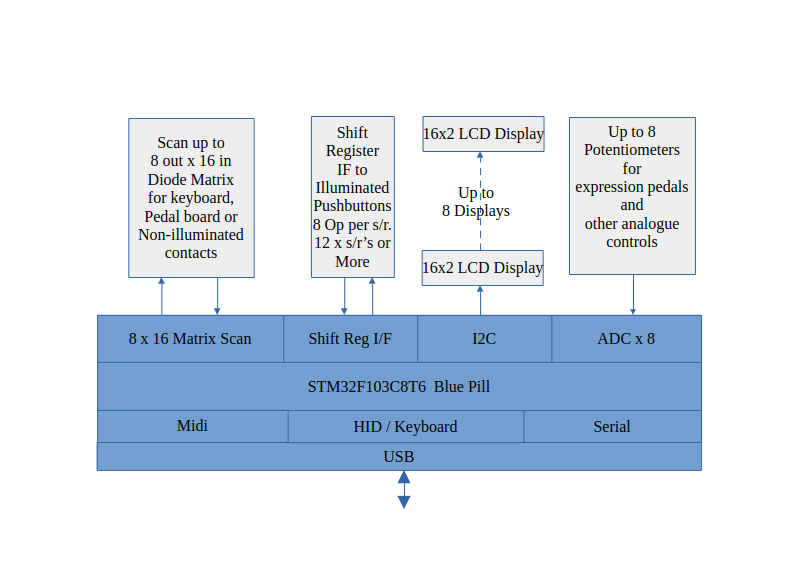

# USB Midi HID Pedalboard Firmware

## Introduction

This project was conceived to connect controls to Virtual Pipe Organ software such as GrandOrgue, Hauptwerk, Cecilia etc running on a touch screen laptop. The design uses a BluePill microcontroller board with few external components. Flexibility is the main motivation as I started with little Midi or VPO experience. This project may work for you too. Let me know how you get on and whether improvements should be made. 
## Block Diagram



## Features
- Hosted on the Arm Cortex-M3 CPU STM32F103C8T6 Bluepill, a ~$2 US development board
- USB Connection to host computer, LED blink on Midi activity
- Multiple STM32 boards may be deployed to ease wiring
- Scanning for MAudio Keystation 61 Keyboard or 32 note pedalboard
- 8 ADC inputs for expression pedals when scanning a pedalboard
- 96 LED illuminated button inputs using external 74HC164 shift registers
- One 6 digit LED display (for combination setter & crescendo display)
- Multiple Liquid Crystal Display modules 16x2 line PCF8574 I2C interface ( 8 per manufacturer type )
- interface to WS2812 LED string for music stand or pedal illumination
- USB HID (qwerty keyboard) messages for music page turning (Future)
- Simulated serial interface over USB for saving configuration in Flash
- Tested using Arduino V1.8.19 with STM32 extensions under Ubuntu 24.04 X86 & Arm Linux
- Printed circuit boards to mount the STM32 Bluepill and shift register interfaces use off the shelf cables to interconnect
## Programming the Blue Pill
Download the file MidiFirmware.ino.bin from github
### First Time
New boards are programmed with a boot loader using the STLINK programmer or a clone.
Take care connecting four wires from the programmer to the BluePill debug connector as they are usually not in order.
The programming tools are incuded with the Arduino enviroment configured for STM32.
* Install the Arduino environment for STM32
* Download a copy of https://github.com/rogerclarkmelbourne/STM32duino-bootloader/blob/master/binaries/generic_boot20_pc13.bin
Run the 'stlink-gui' command.
```
 $ stlink-gui
```
* Use 'Open' to select the file generic_boot20_pc13.bin
* Use 'Connect' to the STLINK
* Use the red flash button to program the bootloader
Remove the 4 wire connection to the STLink programmer
### Load the midi software into the BluePill
Connect the BluePill USB interface to your computer.
You may have to provide some additional path information to the command below depending on where you installed arduino
```
 $ maple_upload ttyACM0 2 1EAF:0003 MidiFirmware.ino.bin ~/Downloads/arduino-1.8.19
```
Once the midi software is loaded the BluePill green LED should breath gently at about 0.5Hz to show that all is well.

## User Manual

See [User Manual](https://github.com/radionerd/VirtualPipeOrgan/blob/main/MidiFirmware/UserManual.md)

## Enhancements
- HID Music Page Turning
- Chord Feature
- Photos
 ## Credits
The code is based on the excellent examples from: 
 - https://github.com/arpruss/USBComposite_stm32f1/tree/master/examples
 - The Arduino and STM32 support teams
 - https://github.com/FearlessNight/bluepill_ws2812/blob/master/bluepill_ws2812.cpp
# License
MIT
