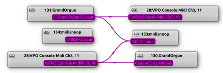

# USB Midi Interface User Manual

This user manual uses Linux OS examples with Grandorgue. For other Operating Systems and Applications similar commands will exist. 

The user manual assumes that you have programed the flash in the STM32 Bluepill using the instructions in [README.md](https://github.com/radionerd/VirtualPipeOrgan/blob/main/MidiFirmware/README.md)

## Features
- Hosted on the Arm Cortex-M3 CPU STM32F103C8T6 Bluepill, a ~$2 US development board
- USB Connection to host computer, LED blink on Midi activity
- Multiple STM32 boards may be deployed to ease wiring
- Scanning for MAudio Keystation 61 Keyboard or 32 note pedalboard
- Up to 4 ADC inputs when configured for a keyboard without velocity sensing
- Up to 8 ADC inputs for expression pedals when scanning a pedalboard
- 64 LED illuminated button inputs using external 74HC164 shift registers
- One 6 digit LED display per midi controller (for combination setter & crescendo display)
- Multiple Liquid Crystal Display modules 16x2 line PCF8574 I2C interface ( 8 per IC type )
- Interface to WS2812 RGB LED string for music stand or pedal illumination
- USB HID (qwerty keyboard) messages for music page turning
- Simulated serial interface over USB for viewing/saving configuration in Flash
- Tested using Arduino V1.8.19 with STM32 extensions under Ubuntu 24.04 X86 & Arm Linux
- Printed circuit boards to mount the STM32 Bluepill and shift register interfaces use low cost plug in cables to simplify wiring

## The USB Connection

To discover whether the midi interface is successfully connected to the computer type 'lsusb' at the command prompt. The midi interfaces and the configured midi channel numbers for keyboard/pedalboard, and the illuminated buttons should show up in the response.
```
$ lsusb
   ...
   Bus 001 Device 094: ID 1eaf:0031 Leaflabs VPO Console Midi Ch3, 11
   Bus 001 Device 095: ID 1eaf:0031 Leaflabs VPO Console Midi Ch4, 12
   ...
```

## Midi Channel Assignment

Midi channels for keyboard/pedalboard are configurable from 1-8 with the illuminated button channel offset by 8.

e.g. If the pedalboard midi channel is set to 4, then the Button midi channel will be 4 + 8 = 12.

## Midi Messages

|  Control   |Chan|   Midi Message  | Direction |
|:----------:|:--:|:---------------:|:---------:|
| Keyboard   |1-8 | Midi Note 32-96 | To   Comp |
| Pedalboard |1-8 | Midi Note 32-64 | To   Comp |
| Expression |1-8 | Midi CC   20-27 | To   Comp |
| Buttons    |9-16| Midi Note 0-127 | To   Comp |
| Button LEDs|9-16| Midi Note 0-127 | From Comp |
| LED 7Seg   |N/A | Sysex ID as Chan| From Comp |
| LCD Display|N/A | Midi Sysex 32-63| From Comp |

ID addresses are shown on the LCD and 7 Segment LED displays after power up.

### Power Up

At power up the midi interface loads the 7 Segment display, LCDs and LED push buttons with the 'PC Comms' message and lights the Push Button LEDs until PC communication is established over the USB. Then Displays are loaded to show their configured addresses. The 7 Segment Display configured address is the same as the Midi channel number. 

|  State   | 7Seg Text  |   LCD Text     | LED Push Buttons  |Built In LED  |
|:--------:|:----------:|:--------------:|:-----------------:|:------------:|
|Power On  |   PC ???   | PC Comms ???   |     All Lit       |   Flash      |
|PC Success|  Add= 3    |VirtualPipeOrgan| Light When Pressed|Breathing .5Hz|
| "    "   |            |i2cAddr=37  0x25|                   | ADC Toggle   |
|GrandOrgue|    GO      |       GO       |        GO         | Note: On/Off |


The Midi Interface LED will flash during initialisation. When communication with the PC is established the Midi Interface LED will slowly get brigter and dimmer at approx 0.5Hz to show that all is well.

When Keyboard or Push button are pressed or released the Midi Interface LED will turn on of off in sync, and resume 0.5Hz breathing after 5 seconds of inactivity. The Builtin LED also toggles on or off when Midi CC messages are sent by the ADC.

Until GranOrgue is running push button LEDs illuminate when pressed as a button and LED test feature.

Once GrandOrgue is running the push button LEDs may be loaded by GrandOrgue midi note on or midi note off messages, the value field 0-127 is ignored.

## Liquid Crystal Displays

The LCDs use PCF8574 based I2C to parallel adapters.

The PCF8574 and PCF8574A ICs on LCD displays use two different address ranges.

Unless you need more than 8 displays it does not matter which kind you buy or whether they are mixed.

The ID adddresses configured in GrandOrgue are Base 10.

|  PCF8574   | Grandorgue | PCF8574A | Grandorgue | A2| A1| A0|
|:----------:|:----------:|:--------:|:----------:|:-:|:-:|:-:|
| 0x20       |      32    |   0x38   |      56    | 0 | 0 | 0 |
| 0x21       |      33    |   0x39   |      57    | 0 | 0 | 1 |
| 0x22       |      34    |   0x3a   |      58    | 0 | 1 | 0 |
| 0x23       |      35    |   0x3b   |      59    | 0 | 1 | 1 |
| 0x24       |      36    |   0x3c   |      60    | 1 | 0 | 0 |
| 0x25       |      37    |   0x3d   |      61    | 1 | 0 | 1 |
| 0x26       |      38    |   0x3e   |      62    | 1 | 1 | 0 |
| 0x27       |      39    |   0x3f   |      63    | 1 | 1 | 1 |

*User solder bridges A0-A2 are used to program zeros and are binary coded. So the default address without any solder bridges is is either 0x27 (39) or 0x3F (63).

The content of the LCD messages may be viewed with the 'l" command, and LCDs may be loaded with the 'L' command.

# Monitoring Midi Messages
Use 'midisnoop' to monitor messages sent between the keyboard/pedalboard and the computer. Select Alsa unless you have Jack configured.
```
$ midisnoop &
```
Midi messages may also be monitored within the Midi Interface using the 'J' command (see below).


# Making Midi Connections
Use 'qjackctl' graph function to view or connect midi outputs to midi inputs.

This works for ALSA and JACK.

```
$ qjackctl &
```
At startup GrandOrgue makes its required midi connections to the midi keyboards.

You may need to re-esatblish connections manually if you restart the STM32 Bluepill.

Connect the Grandorgue output to VPO Console and midisnoop inputs using the qjacktctl graph feature and mouse.

Connect the VPO Console output to Grandorgue and midisnoop inputs using the qjacktctl graph feature and mouse.



Alternatively edit and run the [autoconnect](https://github.com/radionerd/VirtualPipeOrgan/blob/main/MidiFirmware/autoconnect) script in background.

## Configuring the Firmware
A simulated USB serial connection is used to communicate with the Midi Interface.
Connect one STM32 BluePill to the computer using a USB cable.
Install 'minicom' and configure it to connect to /dev/ttyACM0 or /dev/ttyUSB0 depending on your OS.
To confirm that you have the expected midi channel and tty device run the command:
```
 $ ll /dev/serial/by-id/
total 0
drwxr-xr-x 2 root root 80 Jun  1 13:53 ./
drwxr-xr-x 4 root root 80 Jun  1 13:53 ../
lrwxrwxrwx 1 root root 13 Jun  1 13:53 usb-New_Zealand_VPO_Console_Midi_Ch3__11_00001-if02 -> ../../ttyACM1
lrwxrwxrwx 1 root root 13 Jun  1 13:53 usb-New_Zealand_VPO_Console_Midi_Ch4__12_00001-if02 -> ../../ttyACM0

```
Once connected successfully expand the minicom window and press the spacebar.
You should see a display that shows which pin functions are assigned.
Configure what you require using the A-J keys, then press 'S' to save.
```
STM32 Blue Pill Assigned Pin Functions
IP_SR_DATA    PB12   USB   GND    
Scan In  0    PB13         GND    
Scan In  1    PB14         3V3    
Scan In  2    PB15         NRST   
Scan In  3    PA_8         PB11   OP_SR_CLOCK
Scan In  4    PA_9         PB10   TM1637_CK
Scan In  5    PA10         PB_1   Scan In  8
USB-          PA11         PB_0   Scan In  9
USB+          PA12         PA_7   Scan In  a
Scan In  6    PA15         PA_6   Scan In  b
Scan In  7    PB_3         PA_5   Scan In  c
Scan Out 4    PB_4         PA_4   Scan In  d
Scan Out 5    PB_5         PA_3   Scan In  e
LCD  I2C_SCL  PB_6         PA_2   Scan In  f
ShareI2C_SDA  PB_7         PA_1   Scan Out 3
Scan Out 6    PB_8         PA_0   Scan Out 2
Scan Out 7    PB_9         PC15   Scan Out 1
               +5V         PC14   Scan Out 0
               GND         PC13   OP_LED
               3V3 | | | | VBAT   
                   | | | |
SWDIO         PA13---+ +---PA14   SWCLK
BOOT1         PB_2 (on Jumper via 100K resistor)

Configuration Menu
A [3] Key/Pedal Midi Channel, Button channel=11
B [ ] Pedalboard & Expression Pedals (ADC inputs)
C [0]   Number of ADC Inputs PA2-PB1
D [✓] Keyboard Velocity Reporting
E [✓] PCF8574 I2C LCDs 16x2
F [✓] TM1637 7 segment, 6 digit display
G [✓] 74HC164 Shift register LED buttons
H [✓] 74HC164 Shift register LED invert
I [ ] Use Debug Connector for WS2812 RGB LEDs PA13,PA14
J [ ] Event Log to USB Serial (may slow response time)
Cfg.Word=3E02
Enter A-L,a-l To adjust cfg value, S to Save, ? - Menu:
```
The event log is useful to monitor midi messages being sent to the computer. However
using the event log may slow down performance and so should not be enabled during normal use.
# Hardware Interface Menu
To monitor activity on attached devices type '?' to view the hardware interface menu.
```
Midi Interface Menu
A-J Adjust config value
K - Keyboard Contacts
L - LCD check
M - Flash memory summary
O - Shift Register IO
P - Profile
S - Save New Configuration
T - Test IO Pins
R - Restore Configuration
V - Version Info
Z - Pin Status
```
### 'K' Keyboard scan result.
The MAudio Keystation 61 Mk3 music keyboard has two contacts per key to sense velocity. Keyboard scanning uses 8 outputs and 16 inputs. When pedalboard is selected the top 8 keyboard input lines are re-assigned to be used as expression pedal (ADC) inputs. The pedalboard scans 32 contacts using 8 outputs and 8 inputs. Alternate inputs are unused when there is no velocity sensing.
```
Keyboard Scan Result Midi Channel 3

0000000000000000 OP0  CN13 PIN4
0000000000000000 OP1  CN13 PIN3
0000000000000000 OP2  CN13 PIN2
0000000000000000 OP3  CN13 PIN1
0000000000000000 OP4  CN14 PIN4
0000000000000000 OP5  CN14 PIN3
0000000000000000 OP6  CN14 PIN2
0000000000000000 OP7  CN14 PIN1
........******** IP *=CN13 input pins 5-6,7=nc,8-13
********........ IP *=CN14 input pins 5-12
```

### 'L' LCD Check

-  I2C Display addresses are configured by PCF8574 solder bridge inputs on the LCD modules, these addresses are then configured in Grandorgue and map through the blue pill. Expect address 0x38-0x3f for Philips/NXP ICs and 0x20-0x27 for TI. The highest address is used when no solder bridges are fitted. Note that Grandorgue specifies the addresses in Base10.

### 'M' Flash Memory Summary
Not really a user feature.  Provided for testing the 'S'ave command.
```
Flash Memory Summary

0800C850 0000 0000 0000 0000 0000 0000 A678 0800
0800C860 FFFF FFFF FFFF FFFF FFFF FFFF FFFF FFFF
...
0801F7F0 FFFF FFFF FFFF FFFF FFFF FFFF FFFF FFFF
0801F800 DEAD 7F58 0000 1000 1E00 1E01 1E03 1E02
...
0801F820 BE72 3E12 3E02 FFFF FFFF FFFF FFFF FFFF
0801F830 FFFF FFFF FFFF FFFF FFFF FFFF FFFF FFFF
...
```
### LED Illuminated Push Buttons

LED lluminated push buttons are connected via 74HC164 shift registers. LEDs may be configured by the 'G' command to light normally or inverse and to have a dim backlight which is useful for reading the button legends in a dim environment.

When the Midi interface powers up all LEDs light briefly as a lamp test feature.

Until the Midi Interface connects to GrandOrgue each button will illuminate when pressed for testing the button and LED operation.

Once GrandOrgue is running the push button LEDs may be loaded by GrandOrgue midi note on or midi note off messages, the value field 0-127 is ignored.

Buttons generate midi note messages on the configured midi channel plus 8.

The first button (00) in the series acts as a shift key. When button 00 is held in, any other button pressed generates is midi note +64. The shift feature may be used to save console buttons. For example a '+1' button may be configured to act as '-1' when shift is pressed.

When a button is held for longer than 4 seconds its midi note is set to auto repeat at 0.5 second intevals. Auto repeat may be useful for adjusting the metronome tempo.


The status of the connected shift registers may be seen with the 'O' command.

```
Shift Register Midi Channel 11 Note Numbers

SR 1   00  i01o  02   03   04   05   06   07  
SR 2   08   09   10   11   12   13   14   15  
SR 3   16   17   18   19   20   21   22   23  
SR 4   24   25   26   27   28   29   30   31  
SR 5   32   33   34   35   36   37   38   39  

i = input on, o = output on
```
The power 'ON' indicator of the GrandOrgue 'Master Controls' panel may be configured with a mouse right click to send the power on status the the shift button (Midi-note 0) LED. In this way it can be seen at a glance when the organ is ready to play.

###Keyboard and Pedalboards

The MAudio Keystation 61 note keyboard connectors are accomodated directly on the PCBs.
The keyboard provides two contacts per note for velocity sensing between the time that the first and second contact operates or releases.
When Velocity sensing is not required, four unused inputs become available for ADC/Expression inputs if required.
When pedalboard operation is selected the same pin assignments are used, so the MAudio Keystation may be used to emulate a pedalboard.

### ADC & Expression Pedals

Up to 8 ADC inputs may be configured for Expression Pedals when the Pedalboard option is selected.

Up to 4 ADC inputs may be configured for Expression Pedals when the Keyboard option is selected without velocity sensing.
Select the number of ADC convertors to use using the 'C' command.
Note. ADC inputs are connected to potentiometers wired between 0v and 3.3V with a 470R resistor connected to the wiper. 
Enabling A->D conversion without any connected input may generate large amounts of meaningless midi CC messages slowing down the sysem.

On GrandOrgue right click on the expression pedal input. 

Click 'Event' and select Bx Controller

Click 'Channel' select your configured midi channel

Click 'Detect Complex MIDI Setup', move the Expression Pedal control as directed.
Note: The midi interface generates CC messages in the range 20-27

Click 'OK' and remember to save the organ settings

### WS2812 LED strip

The LED feature is intended for illuminating music stands and pedalboards.

The LED strip is controlled by pressing the lowest C# on the midi controller to which the LED strip is connected. The C# is only active for LED control when no other notes have been active for the previous 5 seconds. The number of key presses will trigger different functions

|   | Short Press   | Long Press |
|:-:|:-------------:|:----------:|
| 1 | Toggle On/Off |Brightness  |
| 2 | Rainbow mode  |Colour(Hue) |
| 3 |               |Saturation  |

Strips up to 60 LEDs in length are supported. 

### Profile
The 'P' command displays the execution times in microsecionds of different feaures in use. This is a development feature to ensure that the system is always responsive with no excessive time delays. Lower case 'p' displays executions times, upper case 'P' clears the recorded times to zero.

### WS2812 LED Strip Control

The LED Strip control is intended to be used for illuminatingthe music stand and pedalboard, or just for decoration.

The WS22812 LED strip is configured (enabled/disabled) using the 'I' command. The status of the LED strip may be viewed with the 'W' command.

The LED strip is controlled using the lowest C# of the keyboard to which it is attached, when no other key activity has been present for 5 seconds or more. The number of times and duration that the C# is pressed determines the brightness, hue and saturation of the LED strip.

|Short Press | Long Press |
|:----------:|:----------:|
| 1 - On/Off | Brightness |
| 2 - Rainbow|    Hue     |
| 3 - Unused | Saturation |

### 'Z' Pin Status
This screen may be useful for viewing the 12 bit ADC results before filtering and conversion to 7 bit midi values.
```
USB Midi Interface Status
id  port   function     kbd  count input error fault
 0  VBAT                 0     0     0     0    ' ' 
 1  PC13       OP_LED    0     0     0     0    ' ' 
 2  PC14   Scan Out 0    0     0     0     0    ' ' 
 3  PC15   Scan Out 1    0     1     0     0    ' ' 
 4  PA_0   Scan Out 2    0     2     0     0    ' ' 
 5  PA_1   Scan Out 3    0     3     0     0    ' ' 
 6  PA_2    IP_ADC  0    0     0    e0    e0    ' ' 
 7  PA_3    IP_ADC  1    0     1   36e   37a    ' ' 
 8  PA_4    IP_ADC  2    0     2   509   51e    ' ' 
 9  PA_5    IP_ADC  3    0     3   749   75c    ' ' 
10  PA_6    IP_ADC  4    0     4   8b4   8a1    ' ' 
11  PA_7    IP_ADC  5    0     5   8d8   8c0    ' ' 
12  PB_0    IP_ADC  6    0     6   a59   a43    ' ' 
13  PB_1    IP_ADC  7    0     7   e10   e1b    ' ' 
14  PB10    TM1637_CK    0     0     0     0    ' ' 
15  PB11  OP_SR_CLOCK    0    60     0     0    ' ' 
16  NRST                 0     0     0     0    ' ' 
17   3V3                 0     0     0     0    ' ' 
18   GND                 0     0     0     0    ' ' 
19   GND                 0     0     0     0    ' ' 
20  PB12   IP_SR_DATA    0     0     0     0    ' ' 
21  PB13   Scan In  0    0     0     0     0    ' '
22  PB14   Scan In  1    0     1     0     0    ' ' 
23  PB15   Scan In  2    0     2     0     0    ' ' 
24  PA_8   Scan In  3    0     3     0     0    ' ' 
25  PA_9   Scan In  4    0     4     0     0    ' ' 
26  PA10   Scan In  5    0     5     0     0    ' ' 
27  PA11         USB-    0     0     0     0    ' ' 
28  PA12         USB+    0     0     0     0    ' ' 
29  PA15   Scan In  6    0     6     0     0    ' ' 
30  PB_3   Scan In  7    0     7     0     0    ' ' 
31  PB_4   Scan Out 4    0     4     0     0    ' ' 
32  PB_5   Scan Out 5    0     5     0     0    ' ' 
33  PB_6 LCD  I2C_SCL    0     0     0     0    '!' 
34  PB_7 ShareI2C_SDA    0     0     0     0    '!' 
35  PB_8   Scan Out 6    0     6     0     0    ' ' 
36  PB_9   Scan Out 7    0     7     0     0    ' ' 
37   +5V                 0     0     0     0    ' ' 
38   GND                 0     0     0     0    ' ' 
39   3V3                 0     0     0     0    ' ' 
40  PA13  WS2812 LEDs    0     0     0     0    ' ' 
41  PA14  WS2812 LEDs    0     0     0     0    ' ' 
42  PB_2        BOOT1    0     0     0     0    ' ' 

```

### Page Turning

The page turning feature is intended to control the display of music shown on the computer monitor using a pdf file viewer such as Evince.

The page turning feature uses the USB Human Interface Device (HID) protocol and appears to the PC as a keyboard.

Page turning is configured using the 'H' and 'S' commands.

The midi interface sends four QWERTY keyboard commands on the USB cable from a single switch depending on how the switch is pressed. The midi interface simulates the pressing of keys, just as though they were entered on the computer keyboard. Page turning will be successful when the file viewer has focus and responds appropriately to the 'Page Up', 'Page Down', 'Home' and 'End' keys.

eg To send 'Page down' one short press.
eg To send 'Home' long press after single presses.
eg To go back one page, two short presses.
A single press followed by a long press will scroll through the entire document forwards.
A double press followed by a long press will scroll through the entire document backwards.

| Short Count | Short Press |  Long Press | Long Repeat |
|:-----------:|:-----------:|:-----------:|:------------|
|      1      |  Page Down  |  Ctrl+Home  |  Page Down  |
|      2      |  Page Up    |  Ctrl+End   |  Page  Up   |

On a good day single short and long presses should be sufficient to work through the music and go back to the beginning.

An off the shelf sustain pedal may make a useful page turning switch.

The page turning switch is attached between 0v and PA14 located on the Debug/Programming connector.

